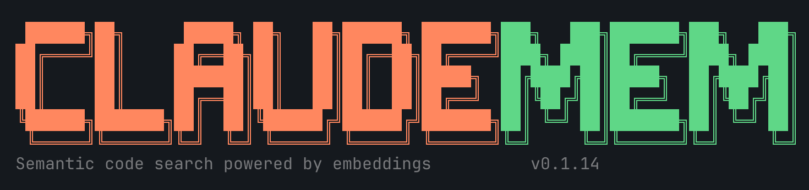
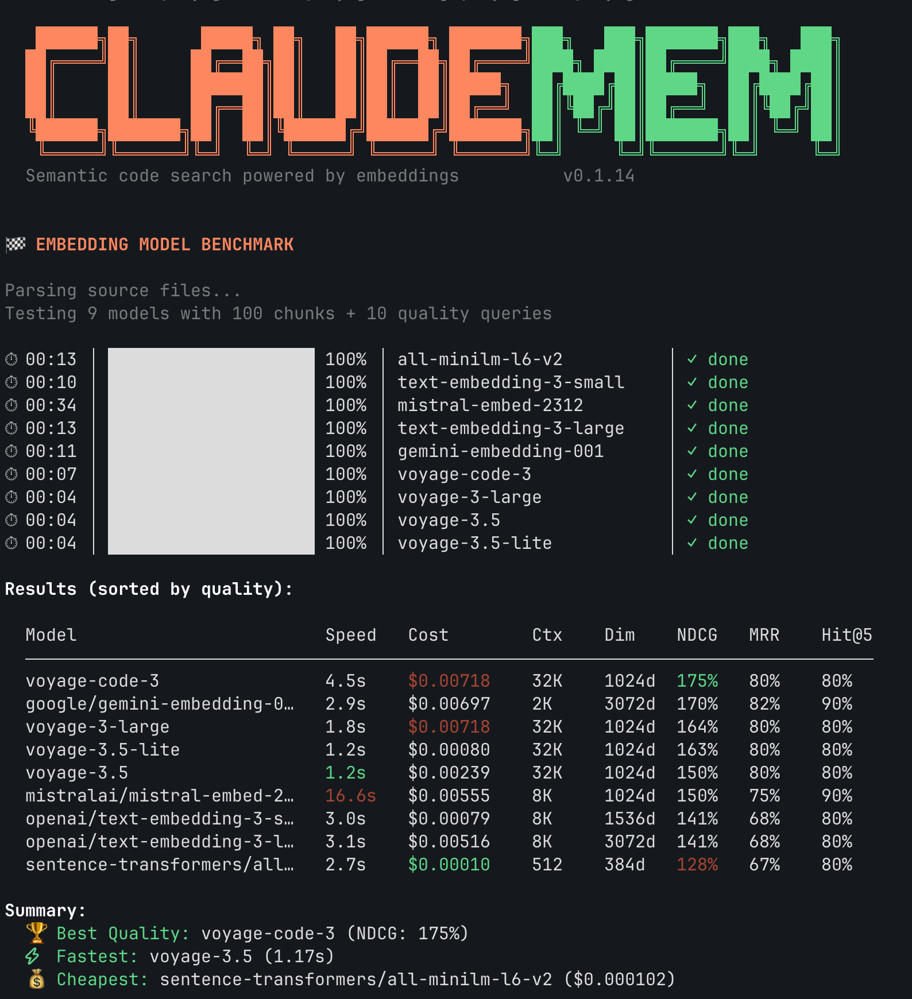

<p align="center">
  
</p>

<p align="center">
  <a href="https://www.npmjs.com/package/claude-codemem"></a>
  <a href="https://opensource.org/licenses/MIT"></a>
  <a href="https://github.com/MadAppGang/claudemem"></a>
</p>

---

Local semantic code search for Claude Code. Index your codebase once, search it with natural language.

## Install

```bash
# npm
npm install -g claude-codemem

# homebrew (macOS)
brew tap MadAppGang/claude-mem && brew install --cask claudemem

# or just curl it
curl -fsSL https://raw.githubusercontent.com/MadAppGang/claudemem/main/install.sh | bash
```

## Why this exists

Claude Code's built-in search (grep/glob) works fine for exact matches. But when you're trying to find "where do we handle auth tokens" or "error retry logic" — good luck.

claudemem fixes that. It chunks your code using tree-sitter (so it actually understands functions/classes, not just lines), generates embeddings via OpenRouter, and stores everything locally in LanceDB.

The search combines keyword matching with vector similarity. Works surprisingly well for finding stuff you kinda-sorta remember but can't grep for.

## Quick start

```bash
# first time setup
claudemem init

# index your project
claudemem index

# search
claudemem search "authentication flow"
claudemem search "where do we validate user input"
```

That's it. Changed some files? Just search again — it auto-reindexes modified files before searching.

## Embedding Model Benchmark

Run your own benchmark with `claudemem benchmark`. Here are results on real code search tasks:

<p align="center">
  
</p>

| Model | Speed | NDCG | Cost | Notes |
|-------|-------|------|------|-------|
| **voyage-code-3** | 4.5s | 175% | $0.007 | Best quality |
| **gemini-embedding-001** | 2.9s | 170% | $0.007 | Great free option |
| **voyage-3-large** | 1.8s | 164% | $0.007 | Fast & accurate |
| **voyage-3.5-lite** | 1.2s | 163% | $0.001 | Best value |
| voyage-3.5 | 1.2s | 150% | $0.002 | Fastest |
| mistral-embed | 16.6s | 150% | $0.006 | Slow |
| text-embedding-3-small | 3.0s | 141% | $0.001 | Decent |
| text-embedding-3-large | 3.1s | 141% | $0.005 | Not worth it |
| all-minilm-l6-v2 | 2.7s | 128% | $0.0001 | Cheapest (local) |

**Summary:**
- 🏆 **Best Quality:** voyage-code-3 (175% NDCG)
- ⚡ **Fastest:** voyage-3.5 (1.2s)
- 💰 **Cheapest:** all-minilm-l6-v2 (local, free)

## Embedding providers

claudemem supports three embedding providers:

### OpenRouter (cloud, default)
```bash
claudemem init  # select "OpenRouter"
# requires API key from https://openrouter.ai/keys
# ~$0.01 per 1M tokens
```

### Ollama (local, free)
```bash
# install Ollama first: https://ollama.ai
ollama pull nomic-embed-text

claudemem init  # select "Ollama"
```

Recommended Ollama models:
- `nomic-embed-text` — best quality, 768d, 274MB
- `mxbai-embed-large` — large context, 1024d, 670MB
- `all-minilm` — fastest, 384d, 46MB

### Custom endpoint (local server)
```bash
claudemem init  # select "Custom endpoint"
# expects OpenAI-compatible /embeddings endpoint
```

View available models:
```bash
claudemem --models           # OpenRouter models
claudemem --models --ollama  # Ollama models
```

## Using with Claude Code

Run it as an MCP server:

```bash
claudemem --mcp
```

Then Claude Code can use these tools:
- `search_code` — semantic search (auto-indexes changes)
- `index_codebase` — manual full reindex
- `get_status` — check what's indexed
- `clear_index` — start fresh

## IDE Integrations

claudemem integrates with AI coding assistants to replace grep/glob with semantic search.

### Claude Code

Install the [code-analysis plugin](https://github.com/MadAppGang/claude-code) for automatic claudemem integration:

```bash
# In Claude Code
/plugin marketplace add MadAppGang/claude-code

# Enable the plugin in settings
# Add to your Claude Code settings:
{
  "enabledPlugins": {
    "code-analysis@mag-claude-plugins": true
  }
}
```

This gives you detective agents that use claudemem under the hood:
- `developer-detective` — trace implementations, find usages
- `architect-detective` — analyze architecture, find patterns
- `tester-detective` — find test gaps, coverage analysis
- `debugger-detective` — trace errors, find bug sources

### OpenCode

Automatic installation:

```bash
# Install plugins (suggestion + tools)
claudemem install opencode

# Check status
claudemem install opencode status

# Uninstall
claudemem install opencode uninstall
```

Manual installation — see [docs/OPENCODE_INTEGRATION.md](docs/OPENCODE_INTEGRATION.md).

## VS Code autocomplete (experimental)

This repo also contains an experimental VS Code inline completion extension that talks to a persistent `claudemem` autocomplete server.

- Autocomplete server: `claudemem --autocomplete-server --project .`
- VS Code extension source: `extensions/vscode-claudemem-autocomplete/`

## What it actually does

1. **Parses code** with tree-sitter — extracts functions, classes, methods as chunks (not dumb line splits)
2. **Generates embeddings** via OpenRouter (default: voyage-3.5-lite, best value)
3. **Stores locally** in LanceDB — everything stays in `.claudemem/` in your project
4. **Hybrid search** — BM25 for exact matches + vector similarity for semantic. Combines both.
5. **Builds symbol graph** — tracks references between symbols, computes PageRank for importance

## Symbol graph & code analysis

Beyond semantic search, claudemem builds a **symbol graph** with PageRank scores. This enables powerful code analysis:

### Dead code detection
```bash
claudemem dead-code
# Finds: symbols with zero callers + low PageRank + not exported
# Great for: cleaning up unused code
```

### Test coverage gaps
```bash
claudemem test-gaps
# Finds: high-PageRank symbols not called by any test file
# Great for: prioritizing what to test next
```

### Change impact analysis
```bash
claudemem impact FileTracker
# Shows: all transitive callers, grouped by file
# Great for: understanding blast radius before refactoring
```

### Keep index fresh
```bash
# Option 1: Watch mode (daemon)
claudemem watch

# Option 2: Git hook (auto-index after commits)
claudemem hooks install
```

## Documentation indexing

claudemem can automatically fetch and index documentation for your project dependencies. This gives you semantic search across both your code AND the frameworks you use.

### How it works

1. **Detects dependencies** from `package.json`, `requirements.txt`, `go.mod`, `Cargo.toml`
2. **Fetches docs** using a provider hierarchy with automatic fallback:
   - **Context7** — 6000+ libraries, versioned API docs & code examples (requires free API key)
   - **llms.txt** — Official AI-optimized docs from framework sites (Vue, Nuxt, Langchain, etc.)
   - **DevDocs** — Consistent offline documentation for 100+ languages
3. **Chunks & indexes** documentation alongside your code
4. **Search everything** with natural language queries

### Setup

```bash
claudemem init  # prompts to enable docs & configure Context7
```

Or configure manually:
```bash
export CONTEXT7_API_KEY=your-key  # get free key at https://context7.com/dashboard
```

### Commands

```bash
claudemem docs fetch              # fetch docs for all detected dependencies
claudemem docs fetch react vue    # fetch specific libraries
claudemem docs status             # show indexed docs & cache state
claudemem docs clear              # clear cached documentation
```

### What gets indexed

| Source | Best For | Coverage | Auth Required |
|--------|----------|----------|---------------|
| **Context7** | Code examples, API reference | 6000+ libs | Free API key |
| **llms.txt** | Official structured docs | 500+ sites | None |
| **DevDocs** | Offline fallback | 100+ langs | None |

### Configuration

In `~/.claudemem/config.json`:
```json
{
  "docs": {
    "enabled": true,
    "providers": ["context7", "llms_txt", "devdocs"],
    "cacheTTL": 24,
    "maxPagesPerLibrary": 10,
    "excludeLibraries": ["lodash"]
  }
}
```

Environment variables:
- `CONTEXT7_API_KEY` — Context7 API key (optional but recommended)
- `CLAUDEMEM_DOCS_ENABLED` — disable docs entirely (`false`)

## Supported languages

TypeScript, JavaScript, Python, Go, Rust, C, C++, Java.

If your language isn't here, it falls back to line-based chunking. Works, but not as clean.

## CLI reference

### Basic commands
```
claudemem init              # setup wizard
claudemem index [path]      # index codebase
claudemem search <query>    # search (auto-reindexes changed files)
claudemem status            # what's indexed
claudemem clear             # nuke the index
claudemem models            # list embedding models
claudemem benchmark         # benchmark embedding models
claudemem --mcp             # run as MCP server
```

### Symbol graph commands (for AI agents)
```
claudemem map [query]       # repo structure with PageRank scores
claudemem symbol <name>     # find symbol definition
claudemem callers <name>    # what calls this symbol?
claudemem callees <name>    # what does this symbol call?
claudemem context <name>    # symbol + callers + callees
```

### Code analysis commands
```
claudemem dead-code         # find potentially dead code (zero callers + low PageRank)
claudemem test-gaps         # find important code without test coverage
claudemem impact <symbol>   # analyze change impact (transitive callers)
```

### Developer experience
```
claudemem watch             # auto-reindex on file changes (daemon mode)
claudemem hooks install     # install git post-commit hook for auto-indexing
claudemem hooks uninstall   # remove the hook
claudemem hooks status      # check if hook is installed
```

### IDE integrations
```
claudemem install opencode                # install OpenCode plugins (suggestion + tools)
claudemem install opencode --type tools   # install tools plugin only
claudemem install opencode status         # check installation status
claudemem install opencode uninstall      # remove plugins
```

### Documentation commands
```
claudemem docs fetch        # fetch docs for all detected dependencies
claudemem docs fetch <lib>  # fetch docs for specific library
claudemem docs status       # show indexed docs and providers
claudemem docs clear        # clear cached documentation
```

### Search flags
```
-n, --limit <n>       # max results (default: 10)
-l, --language <lang> # filter by language
-y, --yes             # auto-create index without asking
--no-reindex          # skip auto-reindex
```

### Code analysis flags
```
--max-pagerank <n>    # dead-code threshold (default: 0.001)
--min-pagerank <n>    # test-gaps threshold (default: 0.01)
--max-depth <n>       # impact analysis depth (default: 10)
--include-exported    # include exported symbols in dead-code scan
--agent               # agent mode: no logo, compact output (for AI tools)
```

## Config

Env vars:
- `OPENROUTER_API_KEY` — for OpenRouter provider
- `CLAUDEMEM_MODEL` — override embedding model
- `CONTEXT7_API_KEY` — for documentation fetching (optional)

Files:
- `~/.claudemem/config.json` — global config (provider, model, docs settings)
- `.claudemem/` — project index (add to .gitignore)

## Limitations

- First index takes a minute on large codebases
- Ollama is slower than cloud (runs locally, no batching)
- Embedding quality depends on the model you pick
- Not magic — sometimes grep is still faster for exact strings

## License

MIT

---

[GitHub](https://github.com/MadAppGang/claudemem) · [npm](https://www.npmjs.com/package/claude-codemem) · [OpenRouter](https://openrouter.ai)
