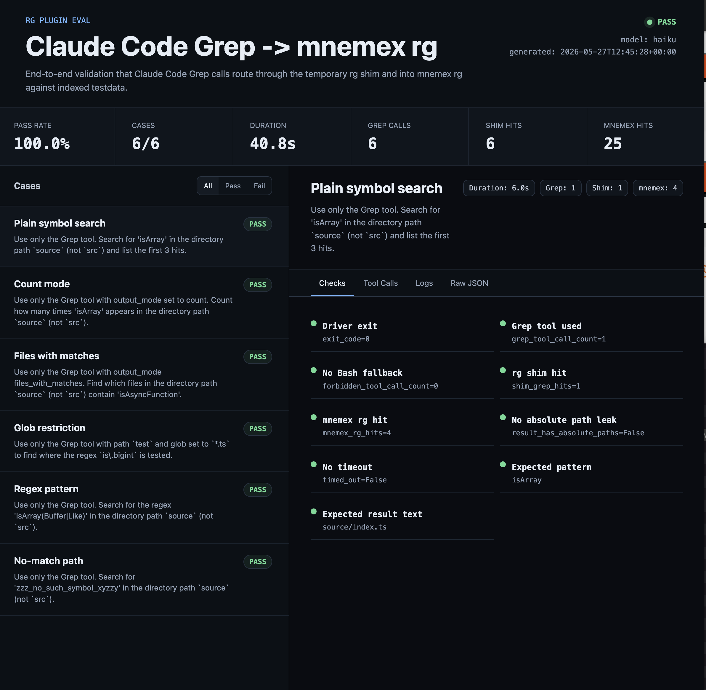
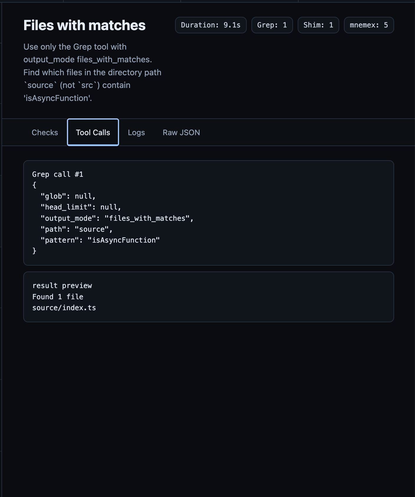
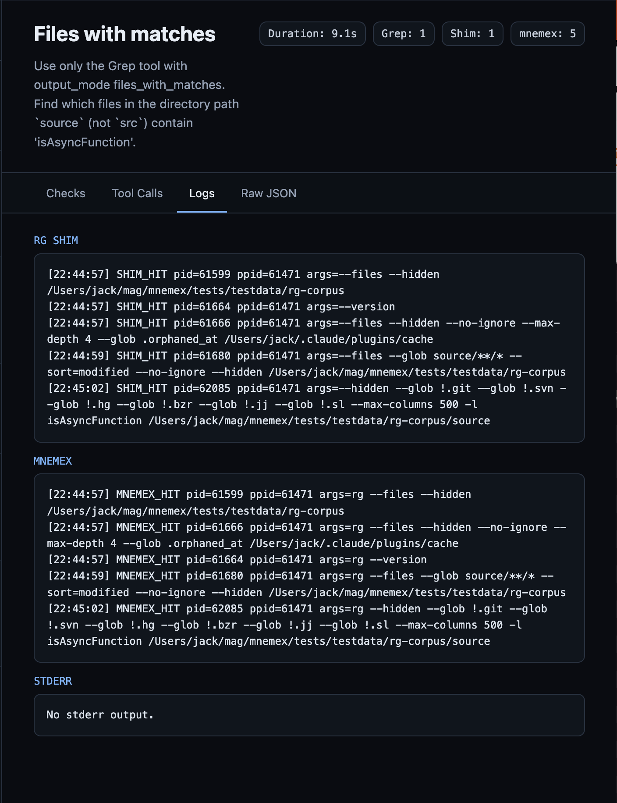

# Building an Eval System for Agentic Tool Calls

When we started testing the `mnemex rg` integration, ordinary unit tests were
not enough. We could prove that `mnemex rg` behaved like ripgrep. We could prove
the binary accepted the right flags. But that still left the real agentic
question unanswered:

> When an agent asks Claude Code to use Grep, does the request actually reach
> our plugin path?

That question pushed us toward an end-to-end eval system. The goal was not to
score model intelligence in the abstract. The goal was to validate the complete
tool trajectory: prompt, Claude Code tool call, temporary `rg` shim,
`mnemex rg`, indexed testdata, and returned result.

## The Problem

The `rg` plugin is deliberately boring at the user boundary. It should look like
ripgrep:

```bash
mnemex rg "isArray" source
mnemex rg --count "isArray" source
mnemex rg --files-with-matches "isAsyncFunction" source
```

That compatibility matters because Claude Code's Grep tool expects
ripgrep-like behavior. If the wrapper changes exit codes, leaks absolute paths,
drops globs, or mishandles count mode, the agent may still appear to work while
no longer being a safe drop-in replacement.

The tricky part is that the agent does not call our TypeScript functions. It
calls a tool. The tool calls an `rg` executable. That executable may come from a
built-in path, a user path, or a plugin-managed shim. So the eval had to observe
the live executable path instead of inferring it from code.

## The Evaluation Contract

The harness validates six behavior slices:

| Case | What it proves |
|---|---|
| Plain symbol search | Claude Code emits a Grep call and returns `source/index.ts` |
| Count mode | Grep `output_mode: count` maps to rg-compatible count output |
| Files with matches | `files_with_matches` returns paths only |
| Glob restriction | `glob` survives tool routing and constrains the search |
| Regex pattern | Metacharacters survive the full shell/tool path |
| No-match query | rg exit code 1 does not break the wrapper or agent session |

Every case shares the same baseline checks:

```json
{
  "exit_code": 0,
  "grep_tool_call_count": ">= 1",
  "forbidden_tool_call_count": 0,
  "shim_grep_hits": ">= 1",
  "mnemex_rg_hits": ">= 1",
  "shim_reaches_mnemex_rg": true,
  "result_has_absolute_paths": false
}
```

Those fields are intentionally concrete. They tell us whether the model used
Grep, whether it avoided Bash fallback, whether the temporary `rg` shim was hit,
whether that shim delegated to `mnemex rg`, and whether the user-facing output
stayed portable.

## The Architecture

The core flow lives in `eval/rg/`:

```text
user prompt
  -> Claude Code
  -> Grep tool
  -> temporary ~/.local/bin/rg logging shim
  -> temporary mnemex wrapper
  -> bun dist/index.js rg ...
  -> tests/testdata/rg-corpus with committed .mnemex index
```

Two details made this robust.

First, the driver creates temporary shims for the duration of each eval case and
restores the user's previous `~/.local/bin/rg` afterwards. The eval is allowed to
touch the real CLI path because that is the path Claude Code uses, but it leaves
the machine clean after each run.

Second, the testdata corpus is pinned in the repo with a committed `.mnemex`
index. That keeps the eval focused on routing and output contracts, not on
whether an index happened to be rebuilt during the run.

## The Eval Dashboard

The report UI gives us a scan-friendly way to inspect the same contract
evidence. It is generated by `bun run eval:rg:report` and saved to
`eval/rg/report/index.html`.



Each case can be inspected through checks, tool calls, logs, and raw JSON.



The log tab keeps the routing proof visible: `SHIM_HIT` from the temporary rg
shim and `MNEMEX_HIT` from the wrapper that delegates to `mnemex rg`.



## The Driver

`eval/rg/driver.ts` is the shared runner used by Promptfoo and the HTML report.
It does four jobs:

1. Validate preconditions: built CLI, bundled rg, Claude CLI, and indexed
   testdata.
2. Install temporary `rg` and `mnemex` shims.
3. Launch `claude -p` with Grep allowed and Bash disallowed.
4. Parse stream JSON plus shim logs into one scoreable JSON object.

The shim is intentionally small:

```ts
writeFileSync(
	mnemexWrapper,
	[
		"#!/bin/sh",
		"# MNEMEX_RG_EVAL_MNEMEX_SHIM",
		'TRACE="${MNEMEX_SHIM_TRACE:-/tmp/mnemex-rg-eval-mnemex.log}"',
		'echo "[$(date +%H:%M:%S)] MNEMEX_HIT pid=$$ ppid=$PPID args=$*" >> "$TRACE"',
		`exec bun ${shellQuote(DIST_CLI)} "$@"`,
		"",
	].join("\n"),
	"utf8",
);

writeFileSync(
	RG_SHIM_PATH,
	[
		"#!/bin/sh",
		"# MNEMEX_RG_EVAL_RG_SHIM",
		'TRACE="${RG_SHIM_TRACE:-/tmp/mnemex-rg-eval-rg.log}"',
		'echo "[$(date +%H:%M:%S)] SHIM_HIT pid=$$ ppid=$PPID args=$*" >> "$TRACE"',
		'exec mnemex rg "$@"',
		"",
	].join("\n"),
	"utf8",
);
```

The Claude Code invocation is locked down so the model cannot silently route
around the test:

```ts
const command = [
	"-p",
	prompt,
	"--allowedTools",
	"Grep",
	"--disallowedTools",
	"Bash",
	"--permission-mode",
	"acceptEdits",
	"--model",
	options.model,
	"--output-format",
	"stream-json",
	"--verbose",
];

const proc = spawnSync("claude", command, {
	cwd: TESTDATA,
	env,
	encoding: "utf8",
	timeout: options.timeout * 1000,
	maxBuffer: 20 * 1024 * 1024,
});
```

That gives us enough information to distinguish "the answer looked right" from
"the right tool path executed."

## Promptfoo as the Smoke Layer

Promptfoo gives us a fast matrix for the six main cases. The YAML is readable
enough to double as living documentation:

```yaml
defaultTest:
  options:
    transform: "JSON.parse(output)"
  assert:
    - type: javascript
      value: "output.exit_code === 0"
    - type: javascript
      value: "output.grep_tool_call_count >= 1"
    - type: javascript
      value: "output.forbidden_tool_call_count === 0"
    - type: javascript
      value: "output.shim_grep_hits >= 1"
    - type: javascript
      value: "output.mnemex_rg_hits >= 1 && output.shim_reaches_mnemex_rg === true"
    - type: javascript
      value: "output.result_has_absolute_paths === false"
```

A test case is just a prompt plus extra assertions specific to that behavior:

```yaml
- description: "Grep in count mode exercises the passthrough fast-path"
  vars:
    prompt: "Use only the Grep tool with output_mode set to count. Count how many times 'isArray' appears in the directory path `source` (not `src`)."
  assert:
    - type: javascript
      value: "output.grep_tool_calls.some(c => c.output_mode === 'count')"
    - type: javascript
      value: "/source\\/index\\.ts:\\s*\\d+/.test(output.grep_tool_result_preview)"
```

Run it with:

```bash
bun run eval:rg:promptfoo
```

## Bun Report as the Rich Eval Layer

Promptfoo is excellent for quick feedback. The Bun report gives us a richer eval
object with per-case scoring, metadata, raw logs, and a self-contained HTML UI.

The report uses the same driver, so it does not create a second truth surface:

```ts
function runCase(testCase: EvalCase, model: string, timeout: number): JsonObject {
	const proc = spawnSync(
		"bun",
		[DRIVER, "--model", model, "--timeout", String(timeout), testCase.prompt],
		{
			cwd: REPO_ROOT,
			encoding: "utf8",
			timeout: (timeout + 20) * 1000,
			maxBuffer: 20 * 1024 * 1024,
		},
	);

	return JSON.parse(proc.stdout ?? "{}") as JsonObject;
}
```

The scorer turns the driver JSON into named checks:

```ts
addCheck(checks, "Driver exit", result.exit_code === 0, `exit_code=${result.exit_code}`);
addCheck(
	checks,
	"Grep tool used",
	Number(result.grep_tool_call_count ?? 0) >= 1,
	`grep_tool_call_count=${result.grep_tool_call_count ?? 0}`,
);
addCheck(
	checks,
	"mnemex rg hit",
	Number(result.mnemex_rg_hits ?? 0) >= 1 &&
		result.shim_reaches_mnemex_rg === true,
	`mnemex_rg_hits=${result.mnemex_rg_hits ?? 0}`,
);
addCheck(
	checks,
	"No absolute path leak",
	result.result_has_absolute_paths === false,
	`result_has_absolute_paths=${String(result.result_has_absolute_paths)}`,
);
```

That means a failure is diagnosable. We can tell whether the model stopped using
Grep, Claude Code missed the shim, `mnemex rg` failed, or the returned text broke
the compatibility contract.

## What We Validated

This eval system validates the agentic integration, not only the binary:

- Claude Code can be prompted into the Grep tool reliably for this suite.
- Grep calls reach a real `rg` executable path controlled by the harness.
- The temporary `rg` shim delegates to `mnemex rg`.
- `mnemex rg` preserves the ripgrep output shapes our agent depends on.
- Count mode, files-with-matches mode, glob filters, regex patterns, and
  no-match behavior all survive the full path.
- User-facing results do not leak absolute local paths.
- The harness restores the developer machine state after each case.

The important distinction is simple: a unit test can prove a function works, but
an agent eval has to prove the agent took the route you think it took.

## Lessons Learned

The most valuable part of this system is the trace boundary. We do not ask the
model "did you use our plugin?" We log the executable path that actually ran.

That made the eval resistant to false positives. If the model falls back to
Bash, the eval fails. If Claude Code uses a built-in ripgrep instead of our shim,
the eval fails. If the wrapper returns a plausible answer but leaks an absolute
path, the eval fails.

For plugin work, that is the shape we want: behavioral tests at the binary
boundary, plus agentic evals one layer higher, where tool calls and routing
actually happen.
